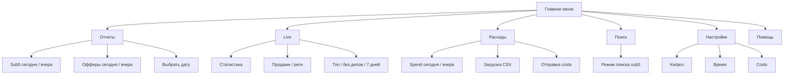

# Документ по визуальному улучшению и упрощению бота

Дата: 2026-05-26

Проект: `Keitaro sub5 report bot`

Источник анализа: текущая реализация меню и кнопок в `bot.js`.

## Цель

Сделать Telegram-бот визуально спокойнее и понятнее для баера: меньше кнопок на первом экране, одинаковые названия действий, ясная навигация по разделам и меньше технического шума.

Главный принцип: первое меню должно быть картой разделов, а не списком всех возможных действий.

## Что сейчас выглядит как мешанина

В текущем `mainMenuKeyboard()` на первом экране сразу 10 кнопок:

```text
Отчет сегодня | Отчет вчера
Офферы сегодня | Офферы вчера
Статистика | Поиск sub5
Расходы FB | Как загрузить CSV
Настройки | Помощь
```

Проблемы:

- На одном уровне смешаны быстрые действия, разделы, справка и настройки.
- Кнопка `Статистика` сразу запускает статистику за сегодня, а `Настройки` открывает раздел. Поведение кнопок непредсказуемое.
- Отчеты, офферы, live-статистика и расходы используют похожие даты, но с разными названиями.
- `Как загрузить CSV` находится в главном меню, хотя это часть раздела расходов.
- Настройки показывают технические термины: `Timezone`, `Каб. timezone`, `Cost group`, `Auto push costs`.
- Справка перегружена списком команд. Это полезно для разработчика, но тяжело для обычного пользователя.
- После нажатий бот часто отправляет новые сообщения с меню, из-за чего чат быстро засоряется.
- В коде уже есть `menu:reports`, но в главном меню нет кнопки, которая ведет в этот раздел.

## Новая структура

Главное меню должно показывать только основные разделы:

```text
Отчеты | Live
Расходы | Поиск
Настройки | Помощь
```

Так первый экран становится короче: 6 кнопок вместо 10. Пользователь сначала выбирает область работы, а не пытается понять весь набор команд сразу.



## Правила для кнопок

- Главное меню - только разделы.
- Внутри раздела - только действия этого раздела.
- Максимум 6 кнопок на главном экране и до 8 кнопок внутри раздела.
- Одинаковые действия называются одинаково во всех меню.
- Даты называются одинаково: `Сегодня`, `Вчера`, `Другая дата`.
- Возврат называется одинаково: `Назад` для шага назад, `В меню` для главного меню.
- Технические слова показываются только там, где они действительно нужны.
- Опасные или внешние действия, например отправка costs в Keitaro, требуют подтверждения.
- После выполнения действия показывать короткое меню продолжения, а не весь список команд.

## Предложенные экраны

### Главное меню

Текст:

```text
Выбери раздел:
```

Кнопки:

```text
Отчеты | Live
Расходы | Поиск
Настройки | Помощь
```

Поведение:

- `Отчеты` открывает меню отчетов.
- `Live` открывает live-аналитику.
- `Расходы` открывает работу с Facebook CSV и costs.
- `Поиск` включает или объясняет поиск по `sub5`.
- `Настройки` открывает сгруппированные настройки.
- `Помощь` показывает короткую справку.

### Отчеты

Текст:

```text
Отчеты из Keitaro:
```

Кнопки:

```text
Sub5 сегодня | Sub5 вчера
Офферы сегодня | Офферы вчера
Другая дата
В меню
```

Пояснение:

- Не нужно держать `Отчет сегодня`, `Отчет вчера`, `Офферы сегодня`, `Офферы вчера` в главном меню.
- Внутри раздела `Отчеты` слово "отчет" уже понятно, поэтому кнопки можно сделать короче.

### Выбор даты для отчетов

После `Другая дата` лучше не спрашивать одной общей фразой, если есть два типа отчетов. Лучше дать выбор:

```text
Что строим за другую дату?
```

Кнопки:

```text
Sub5 отчет | Офферы
Назад | В меню
```

После выбора бот просит дату:

```text
Пришли дату: 2026-05-26 или 26 мая 2026.
```

### Live

Текст:

```text
Live-аналитика:
```

Кнопки:

```text
Сегодня | Вчера
Продажи | Реги
Топ sub5 | Без депов
7 дней | Другая дата
В меню
```

Пояснение:

- Текущая кнопка `Статистика` в главном меню должна открывать этот раздел, а не сразу запускать `stats:today`.
- `Проблемные` лучше заменить на `Без депов`, потому что это понятнее: речь о sub5, где есть реги, но нет депов.
- `Top` лучше показывать как `Топ sub5`, чтобы было ясно, что ранжируется.

### Расходы

Текст:

```text
Расходы Facebook и costs:
```

Кнопки:

```text
Spend сегодня | Spend вчера
Загрузить CSV
Настройки costs
В меню
```

После загрузки CSV:

```text
CSV загружен. Найдено строк: N. Spend: X USD.
```

Кнопки:

```text
Отправить costs в Keitaro
Показать spend
Инструкция CSV
В меню
```

Перед отправкой costs:

```text
Отправить costs в Keitaro по этому импорту?
```

Кнопки:

```text
Да, отправить
Отмена
```

Пояснение:

- `Как загрузить CSV` не должен быть в главном меню. Это часть раздела `Расходы`.
- `Отправить costs в Keitaro` должен появляться только после загрузки CSV или при открытии конкретного импорта.
- Внешнее действие в Keitaro лучше подтверждать отдельной кнопкой.

### Поиск

Текст:

```text
Поиск по sub5:
```

Кнопки:

```text
Начать поиск
Формат sub5
В меню
```

После `Начать поиск`:

```text
Пришли один или несколько sub5, каждый с новой строки.
```

Кнопки:

```text
Выйти из поиска | В меню
```

Пояснение:

- Сейчас `Поиск sub5` в главном меню сразу включает режим. Это удобно для опытного пользователя, но неожиданно для нового.
- Лучше иметь отдельный экран, где понятно, что дальше нужно прислать `sub5`.

### Настройки

Главный экран настроек:

```text
Настройки:
```

Кнопки:

```text
Keitaro | Время
Costs | Доступ
В меню
```

Раздел `Keitaro`:

```text
URL | API key
Timezone
Назад
```

Раздел `Время`:

```text
Час обновления
Timezone кабинетов
Назад
```

Раздел `Costs`:

```text
Валюта | Группа
Автоотправка
Назад
```

Раздел `Доступ` можно добавить позже, если появится управление allowlist прямо из бота. Пока можно не показывать его, чтобы не обещать неготовую функцию.

Пояснение:

- Текущие настройки можно оставить в коде как есть, но пользователю показывать более человеческие названия.
- `Auto push costs` лучше заменить на `Автоотправка`.
- `Cost group` лучше заменить на `Группа`.
- `Каб. timezone` лучше заменить на `Timezone кабинетов`.

### Помощь

Справка должна быть короткой:

```text
Бот помогает баеру:

1. Строить отчеты sub5 и офферов из Keitaro.
2. Смотреть live-реги, депы и проблемные sub5.
3. Загружать Facebook CSV и отправлять costs в Keitaro.
4. Искать результаты по конкретному sub5.

Основное управление - кнопками.
Команды для быстрого доступа: /report, /stats, /spend, /find, /settings.
```

Полный список команд можно оставить ниже отдельной строкой:

```text
Полный список команд: /commands
```

Для этого можно добавить отдельную команду `/commands`, а `/help` сделать коротким.

## Новые названия кнопок

| Сейчас | Предложение | Где показывать |
| --- | --- | --- |
| `Отчет сегодня` | `Sub5 сегодня` | Отчеты |
| `Отчет вчера` | `Sub5 вчера` | Отчеты |
| `Офферы сегодня` | `Офферы сегодня` | Отчеты |
| `Офферы вчера` | `Офферы вчера` | Отчеты |
| `Статистика` | `Live` | Главное меню |
| `Проблемные` | `Без депов` | Live |
| `Топ` | `Топ sub5` | Live |
| `Расходы FB` | `Расходы` | Главное меню |
| `Как загрузить CSV` | `Загрузить CSV` | Расходы |
| `Инструкция CSV` | `Инструкция CSV` | Расходы |
| `Настройки costs` | `Настройки costs` | Расходы |
| `Auto push costs` | `Автоотправка` | Настройки costs |
| `Cost currency` | `Валюта` | Настройки costs |
| `Cost group` | `Группа` | Настройки costs |
| `Каб. timezone` | `Timezone кабинетов` | Настройки времени |

## Поведение после действий

После отчета:

```text
Готово: отчет за 2026-05-26.
```

Кнопки:

```text
Еще отчет | В меню
```

После live-статистики:

```text
Live за сегодня:
...
```

Кнопки:

```text
Live меню | В меню
```

После поиска:

```text
Найдено по sub5:
...
```

Кнопки:

```text
Искать еще | В меню
```

После ошибки:

```text
Не получилось: причина.
```

Кнопки:

```text
Повторить | В меню
```

## Что изменить в коде

Минимальный набор изменений:

1. Переделать `mainMenuKeyboard()` на 6 разделов.
2. Использовать уже существующий `menu:reports` для кнопки `Отчеты`.
3. Добавить обработчики `menu:live`, `menu:spend`, `menu:search`, `menu:settings`.
4. Добавить отдельные клавиатуры:
   - `liveMenuKeyboard()`;
   - `spendMenuKeyboard()`;
   - `searchMenuKeyboard()`;
   - `settingsMainKeyboard()`;
   - `settingsKeitaroKeyboard()`;
   - `settingsTimeKeyboard()`;
   - `settingsCostsKeyboard()`.
5. Сделать кнопку `Live` навигационной, а `stats:today` оставить внутри live-раздела.
6. Перенести `costs:help` из главного меню в раздел `Расходы`.
7. Переименовать кнопки по таблице выше.
8. Добавить подтверждение перед `cost_push`.
9. Сократить `/help`, а полный список команд вынести в `/commands`.
10. По возможности обновлять текущее меню через `editMessageText`, чтобы не плодить новые сообщения в чате.

## Очередь внедрения

### Этап 1. Быстро привести меню в порядок

Сделать:

- новое главное меню на 6 кнопок;
- разделы `Отчеты`, `Live`, `Расходы`, `Поиск`;
- единые названия кнопок;
- короткую справку.

Результат: бот уже выглядит спокойнее, а пользователь не видит все действия сразу.

### Этап 2. Настройки разложить по группам

Сделать:

- отдельный главный экран настроек;
- подменю `Keitaro`, `Время`, `Costs`;
- более человеческие названия кнопок;
- сохранить текущий ввод значения следующим сообщением.

Результат: настройки перестают выглядеть как список переменных из кода.

### Этап 3. Уменьшить шум в чате

Сделать:

- использовать `editMessageText` для навигационных экранов;
- после действий показывать 1-2 релевантные кнопки продолжения;
- для ошибок показывать `Повторить` и `В меню`.

Результат: чат не засоряется одинаковыми меню.

### Этап 4. Безопасные действия

Сделать:

- подтверждение перед отправкой costs в Keitaro;
- понятный итог после отправки: сколько строк ушло, сколько пропущено, где ошибка;
- кнопку `Отмена`.

Результат: меньше риска случайно отправить costs.

## Критерии готовности

Интерфейс можно считать упрощенным, если:

- в главном меню не больше 6 кнопок;
- на первом экране нет кнопок `Сегодня` / `Вчера`;
- каждый раздел содержит только свои действия;
- пользователь может открыть отчет за сегодня за 2 нажатия: `Отчеты` -> `Sub5 сегодня`;
- пользователь может открыть live-статистику за сегодня за 2 нажатия: `Live` -> `Сегодня`;
- загрузка CSV и инструкция CSV находятся только в разделе `Расходы`;
- настройки разделены на группы и не выглядят как технический конфиг;
- `/help` помещается в один экран Telegram без длинного списка всех команд;
- отправка costs в Keitaro требует подтверждения.

## Итоговая рекомендация

Начать с этапа 1: заменить главное меню на разделы и вынести текущие быстрые действия внутрь разделов. Это даст максимальный визуальный эффект без изменения бизнес-логики бота.

После этого можно аккуратно улучшить настройки и поведение после действий.
